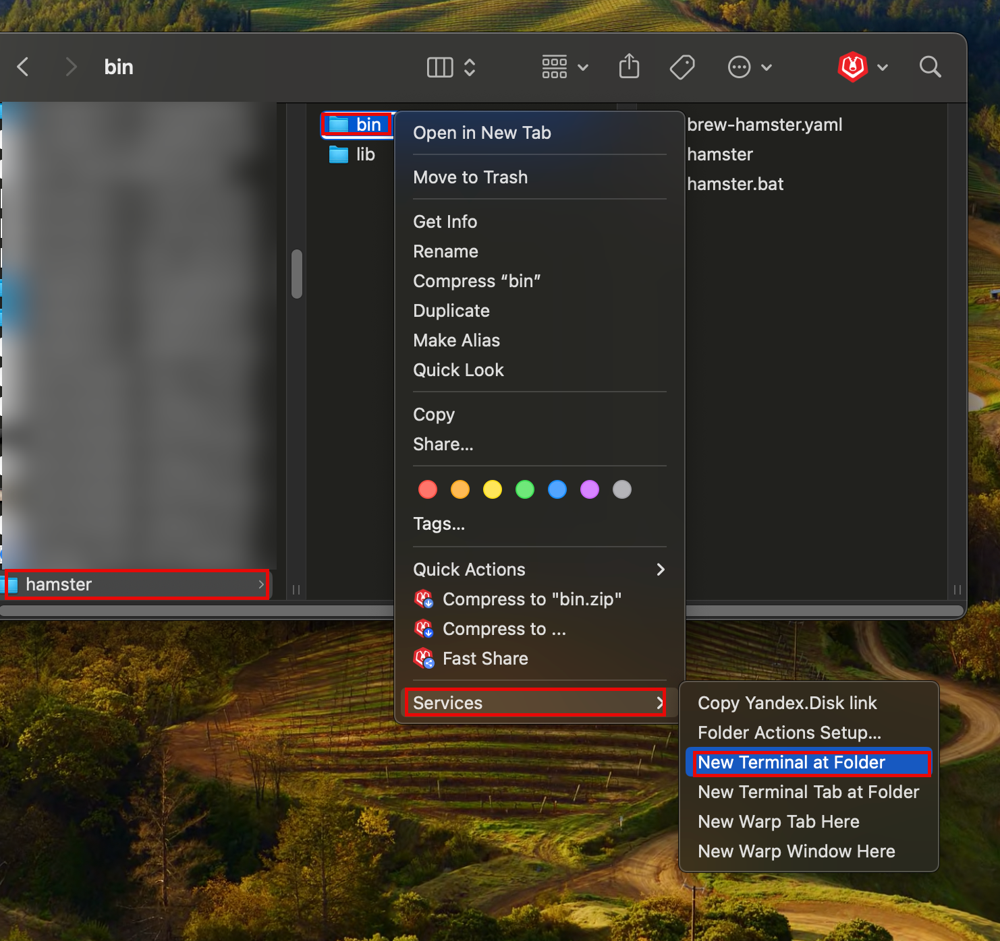
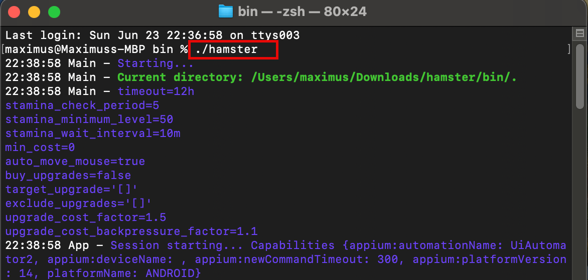

# How to run bot

## Prepare your environment

- For MacOS : [preparation-macos.md](preparation-macos.md)
- For Windows: [preparation-windows.md](preparation-windows.md)

## Run emulator and open Hamster Kombat Game
- Open Android Studio
- Open your project created during [preparation-macos.md](preparation-macos.md)
- Run emulator create during [preparation-macos.md](preparation-macos.md)
- Open Hamster Kombat Game in emulator

> !!! **Set Game Language to English** !!!

## Download latest release
- Go to: https://github.com/kochetkov-ma/hamster-kombat-farm/releases
- And download latest `hamster.zip` (for example, not latest https://github.com/kochetkov-ma/hamster-kombat-farm/releases/download/v0.5.0/hamster.zip)
- Extract `zip` file to your folder and go to folder `hamster`

## Configure `brew-hamster.yaml`
- You don't need configure for first run
- But open `brew-hamster.yaml` and configure it for your needs

## Run Bot

Thera are **3 ways** to run bot:

### In Finder > Terminal
- Go to `hamser`directory in Finder > `bin` > Right Mouse Click (Open Context Menu) > `Services` > `New Terminal at Folder`

- In Terminal run command `./hamster`

### In Android Studio

### Jar in Android Studio
