# Get Started. Instruction. MacOS
Watch the [Telegram channel](https://t.me/hamster_kombat_farm_bot_free) and `YouTube channel` for updates.

### Prepare Environment

#### 1. Download and install the latest version of Java 21
- Apple(ARM) https://download.oracle.com/java/21/archive/jdk-21.0.2_macos-aarch64_bin.dmg
- Intel(x64) https://download.oracle.com/java/21/archive/jdk-21.0.2_macos-x64_bin.dmg

#### 2. Download and install Android Studio
See latest version on https://developer.android.com/studio
- Apple(ARM) https://redirector.gvt1.com/edgedl/android/studio/install/2024.1.1.11/android-studio-2024.1.1.11-mac_arm.dmg
- Intel(x64) https://redirector.gvt1.com/edgedl/android/studio/install/2024.1.1.11/android-studio-2024.1.1.11-mac.dmg

#### 3. Prepare Android SDK and create Emulator by Android Studio
- Open `Android Studio`
- Cancel `Android Stydio Setup Wizard` if exists

  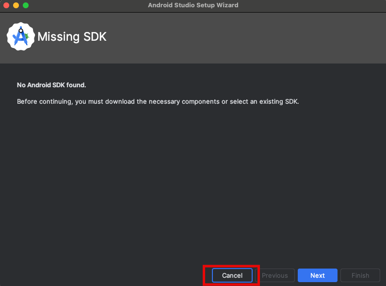
- You should see `Welcome to Android Studio` screen and click `New Project`

  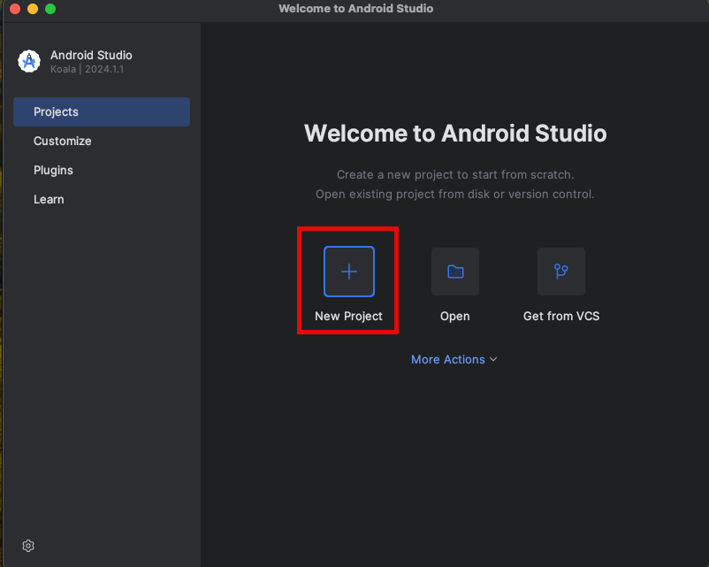
- Keep default settings, only `Minimum SDK` should be `API 34: ("UpsideDownCake" ;Android 14)`
- Click `Finish`

  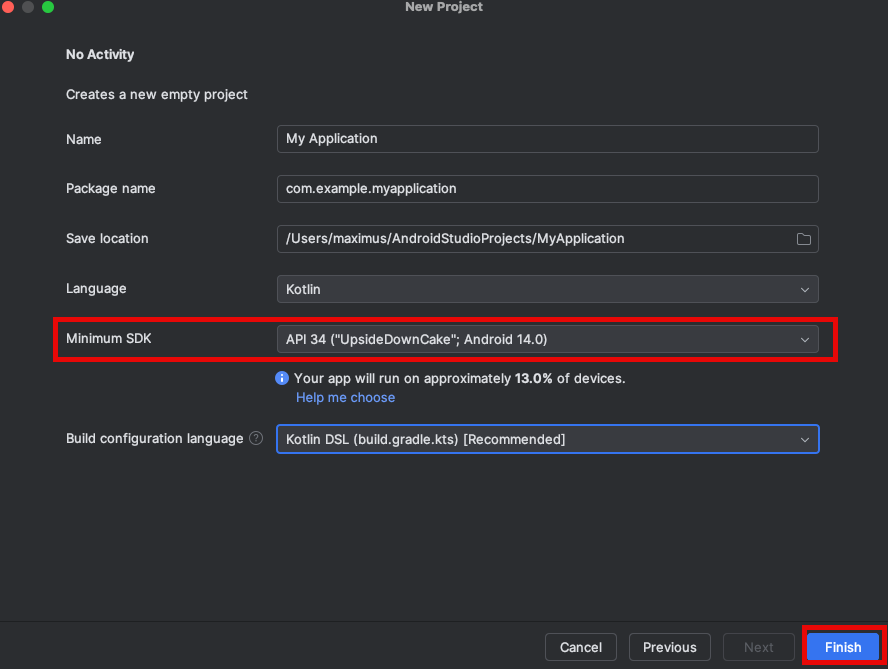
- Wait for download and install `Android SDK`

  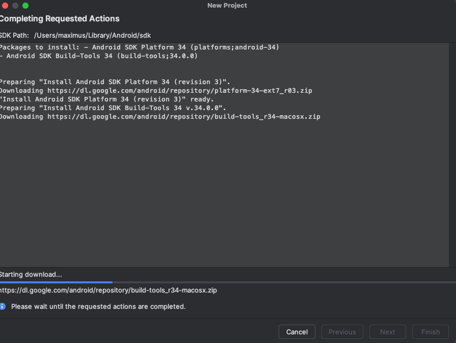
- New project should be created

  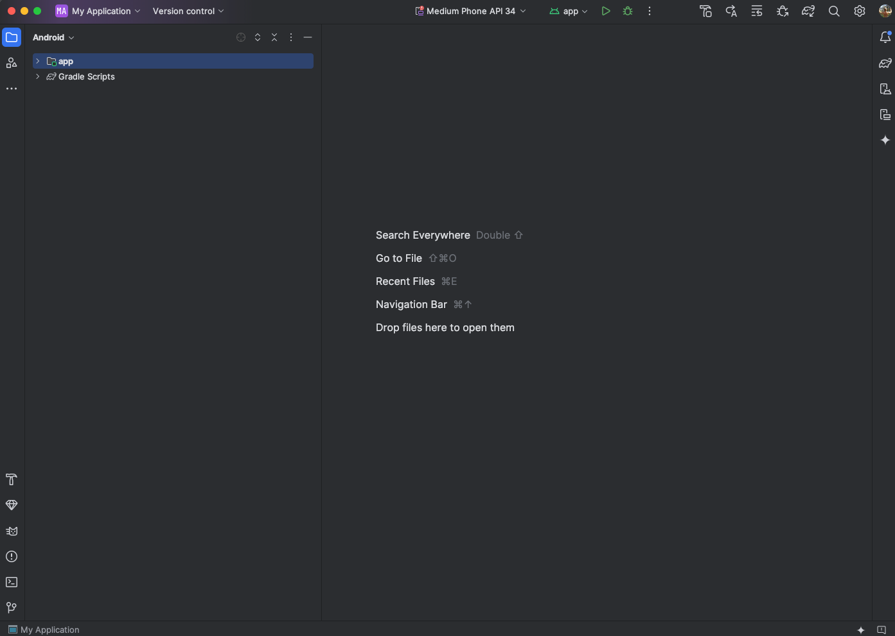

#### 4. Install and Run Android Emulator
- Open project and expand left panel `Device Manager`

  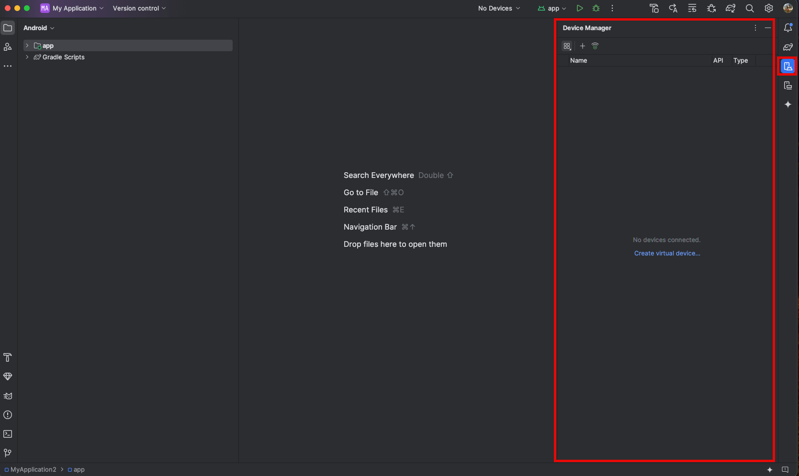
> If you don't see `Device Manager` click `View` -> `Tool Windows` -> `Device Manager`
>
> 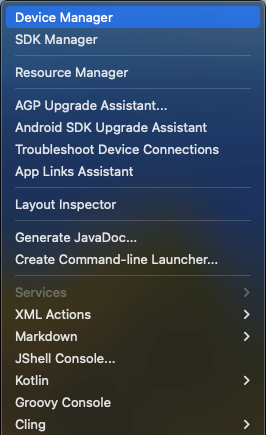
- Click `Create Virtual Device...` > screen `Configuration` opened
- Select `Medium Phone` and click `Next`

  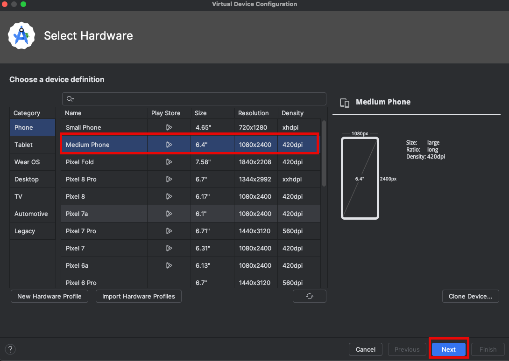
- SDK will be installed, wait for it

  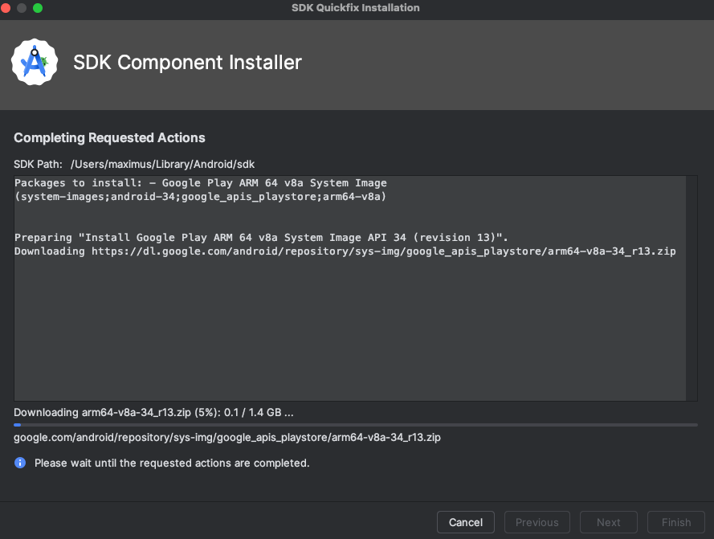
- Select Image `API 35` and click `Next`

  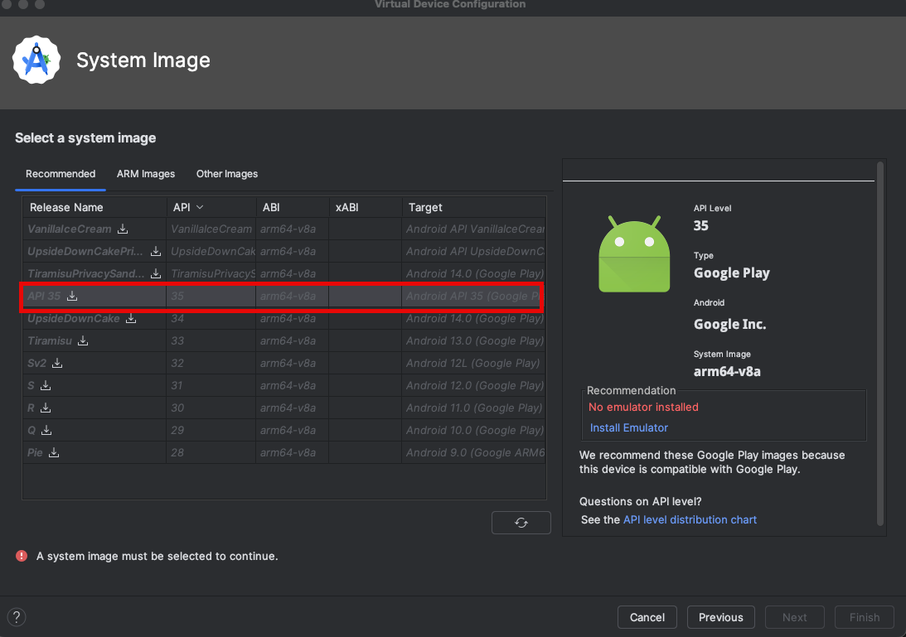
- Then don't click `Finish` but click `Install Emulator` and wait for it

  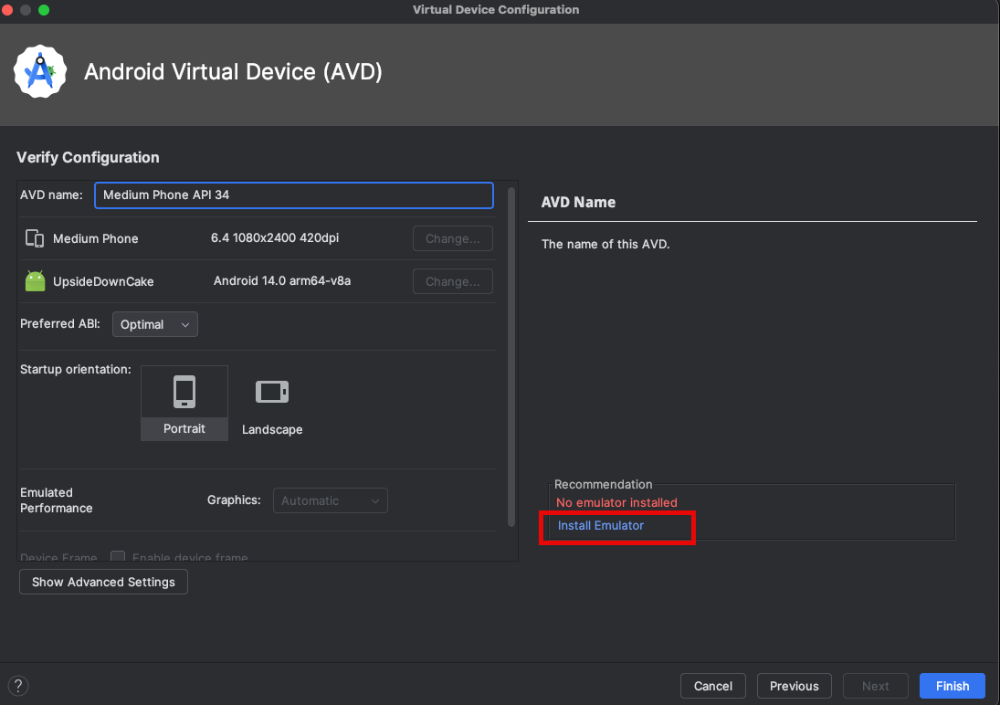
- After installation click `Finish`

  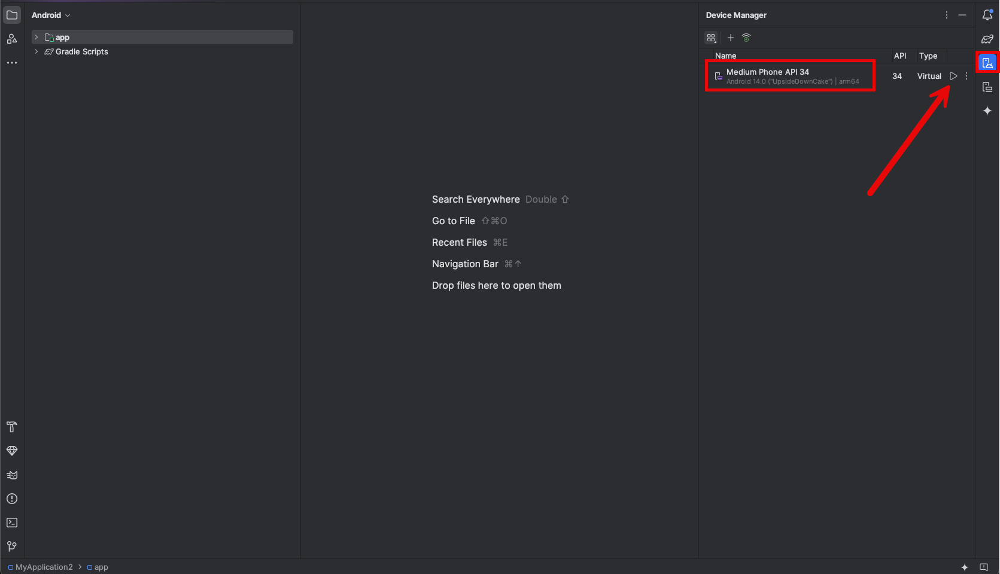
- Project opened and you should see your emulator `Medium Phone API 34` in `Device Manager`. Click `Run` button

  
- Emulator opened

  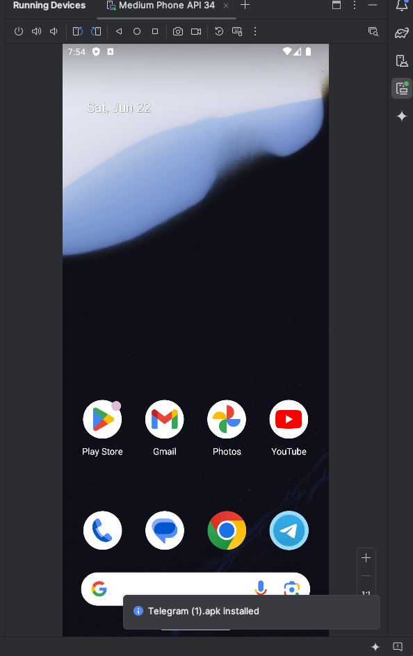

#### 5. Install Telegram to Emulator and SignIn to your Account
Download: https://telegram.org/dl/android/apk

Install to Emulator by Drug and Drop:

- Telegram Icon Should be on First Screen
    - Drug And Drop Installed Telegram app to main screen

  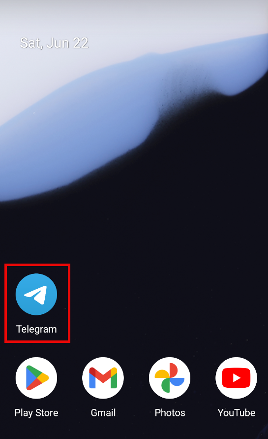

Sign In to your Telegram Account with Hamster Kombat Game

#### 6. Set `ANDROID_HOME` Environment Variables
- Open `Terminal`

  
- run command: `open ~/.zshrc`
- Add line: `export ANDROID_HOME=~/Library/Android/sdk`
- Close `Terminal`

To check:
- Open **new** Terminal window
- run command: `echo $ANDROID_HOME`
- output should be like this: `/Users/username/Library/Android/sdk`

> see detailed instruction: https://developer.android.com/tools/variables

#### Download and Install Node.js
See latest version on https://nodejs.org/en/download/prebuilt-installer

- Apple(ARM) https://nodejs.org/dist/v20.15.0/node-v20.15.0.pkg

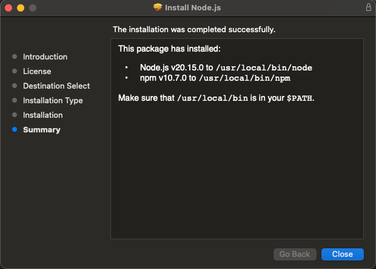

##### Install Appium by Terminal
- Open `Terminal`

  
- run command: `sudo npm i --location=global appium`

  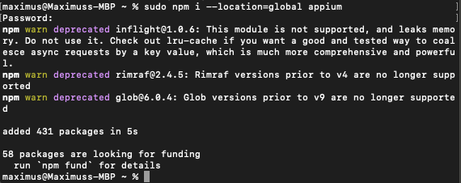

> Congratulations! You are ready to start the game!
